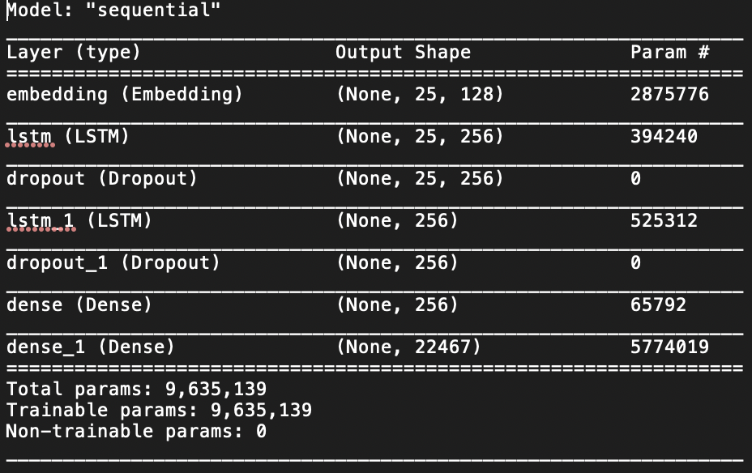

# Quoth the Raven

---

## Table of Contents:
* [Background and Project Problem Statement](#problem)
* [Proof of Concept Application Outline](#proof)
* [Natural Language Generation Model](#nlg)
    * [Long Short-Term Memory RNN](#lstm)
    * [Generative Pre-trained Transformer 2](#gpt2)
* Image Captioning -- IN PROCESS
* Model Integration and Deployment -- IN PROCESS
* [Recommendations and Next Steps](#recs)
    * [Natural Language Generation](#nlgrecs)
    * [Other Project Phases](#next)
* [References and Resources](#refs)


## <a name="problem"></a>Project Background and Problem Statement:

### Background

A social media team managing the brand presences for a diverse set of literary creative talent asked: "How can we better leverage our current creative assets to engage existing and potential fan bases to augment and expand the brand of our clients?"

**The team identified three goals:**
1. Drive Web Traffic
    * We’ve invested heavily in unified online presences to engage potential fans via newsletter signups, embedded social media stream/highlights, merch, and latest news.
        * How can we drive more traffic to the landing pages?
2. Leverage Client IP
    * Our literary clients have bodies of existing work (novels, essays, screenplays, etc.).
        * How can we use this to our advantage?
3. Every Account a VIP
    * We have limited/shifting account managers for many of our clients. 
        * How can we maintain the authenticity for each client’s presence? 

In order to meet these three goals, we'll develop a proof of concept application to address each of the three goals:
1. Drive Web Traffic
    * Application will be embedded on client landing page generating content that will be shareable via social media. This will allow deepen connection to current fans while simultaneously allowing them to become brand advocates by sharing their affinity with the brand via social media.
2. Leverage Client IP
    * Application will utilize Natural Language Generation model trained on a selected corpus of the client's work.
3. Every Account a VIP
* The Natural Language Generation model can be applied to other uses such as seeding content marketing ideas by generating responses to prompts directly from the client's own on-brand corpus. This will allow a smaller team to edit or cultivate content rather than create it from the ground up.

### Problem Statement:
If a picture paints a thousand words, what words would an AI version of Edgar Allan Poe paint based on a user supplied picture? Utilizing neural networks and the complete works of Edgar Allan Poe, and an image, let's find out.

---

## <a name="proof"></a>Proof of Concept Application Outline:

We'll create an application named "Quoth the Raven" (or QTR) that accomplishes the following:


The project will be broken down into three phases:


We'll start with Natural Language Generation Model

---

## <a name="nlg"></a>Natural Language Generation Model
### Data Acquisition
We'll need a nice clean collection of Poe's writing to train our model on. The cleanest, completest set of Poe's writing is readily available for free as text files at [Project Gutenberg](https://www.gutenberg.org/ebooks/search/?query=edgar+allan+poe&submit_search=Go%21). Miscellaneous rough cleaning was executed on the five volumes of collected works of Poe in a text editor including removing Project Gutenberg text, prefaces and notes not written by Poe, and removing titles. Poetry was also separated from prose writing (though any verse that was included in the short stories was left in the documents). Original text and the trimmed files can be found in the data folder of the repository.


So why select Poe?
* Personal affinity
* Enough content to create our model
* Works are accessible and in the public domain
* Distinctive writing style
    * Allows us to see if model is actually generating based on our text (especially true for GPT-2 model)

### <a name="lstm"></a>Model 1: Long Short-Term Memory (LSTM) Neural Network
#### Data Preparation
In order to produce stories, we want our model to be able to generate text as fully as possible -- that means we want it to not only be able understand how words relate to each other, but where capitalization and punctuation should happen. In an attempt to see if this is possible, the text was combined into one large corpus and broken into words (retaining capitalizing) with punctuation marks treated as words as well. The text was than broken down into sequences of "words" for feeding into the LSTM model. The 26-word sequence was selected for use (a 25-word input sequence with the 26th as the word to predict). These sequences were reshaped into arrays for use in the model.

### LSTM Model Building and Training
Utilizing a tutorial from [Jason Brownlee](https://machinelearningmastery.com/how-to-develop-a-word-level-neural-language-model-in-keras/), an LSTM was built with the following architecture:



The LSTM model was selected for its ability to "remember" past states of our word.

The corpus preparation, model building, and fitting of the data on the model was all done on GPU equipped remote virtual computer on Amazon Web Services. The training was conducted over 8 hours and for 100 epochs. 


Model weights were saved for every epoch that demonstrated an improvement in loss. The weights, model, and architecture diagram were then downloaded from the remote machine and placed in the repository for generation.

#### LSTM Results:
The model and accompanying files were then loaded into a text generation notebook. Here is representative sample result (others are available in the notebook):

```
Prompt: The meaning of life is

Result: thus French came erect forever in stature and device . Suddenly he floated close at the corners of the angels, which pressed upon the street with Peters, and giving this terrible position very near into way by regard to the mesmeric influence, it must rise to commence...

```
Positives:
* After 8-hours of training on our text, the model is clearly beginning to build associations between the word tokens it is being fed.
* The language is clearly that of Poe (with hints of macabre).

Negatives:
* While occasionally making some sense, the model is often gibberish.
* Punctuation is better than expected, but not good.
* This model requires a lot more training as well as several experiments with word cleaning and preparation, model architecture, and tuning of hyperparameters.
* Additionally, if we’re looking to build an application or other tools that will need to model multiple clients, we’re looking at a large investments in time and computing power.


### <a name="gpt2"></a>Model 2: GPT-2
#### Data Preparation and Model Finetuning
With the lauded result generated by GPT-2 (Generative Pre-trained Transformer 2) on language tasks widely known, it was an obvious candidate for finetuning for our needs. [Max Woolf’s gpt-2-simple (GPT-2 wrapper)](https://minimaxir.com/2019/09/howto-gpt2/) was selected to access the model due to its clear instructions and premade Google Colab notebook that allowed free access to a GPU for training. Data tokenization was handled via the customized wrapper after passing a combined text file directly into it.

Customizing aspects of the notebook for use with our data, the GPT-2 medium size model (355 million parameters) and our model was finetuned on our corpus over 10,000 steps. The model was saved and used to generate the following representative sample:

```
Prompt: The meaning of life is

Result: obscure, and its effects are yet mysterious. It is not, however, that the dim visions which cover the minds of the brave fade away—they acquire a brilliant lustre as the dawn of the morning—they acquire a brilliancy as the diamonds of the emerald sky. Look not into the abyss—into the glittering waters—into the silent doubt-storms—into the smiling smiles of the smiling children of the fair Alaska. These are not the fancies of fancy, nor are they the...

```
Positives:
* Fast training with greatly improved results compared to LSTM model.
* Overall, the text makes sense and the language is Poe (though other language from the general model can appear).
* The model can be trained/updated/added to easily via the finetuning wrappers.

Negatives:
* Since we are not sure of all the data that the underlying model is trained on, any biases that may be present (in addition to some that can surface using our Poe data) are not clear to us.
* Computational weight of deployment -- will it require a server with a GPU to make it create content efficiently?
* Not all generated content is good -- will need to write evaluation process for final model output for user generated content.

---

## <a name="recs"></a>Recommendations and Next Steps:
### <a name="nlgrecs"></a>Natural Language Generation
#### Recommendation:

Continue developing GPT-2 model. It's...

1. Fast & Easy
    * Training for even a short time produces results – with additional data prep, parameter tweaks, and finetuning we can continue to improve this output.
2. Expandable
    * Models can be updated/expanded using additional data sources (new material or modeling of most well-received past content).
3. Multi-purpose
    * Beyond the app, the models can be used for other purposes (i.e., kickstart content generation ideas using previous on-brand data via automated email to account managers with prompts scraped from tracked google notifications/trends)

#### Next Steps:
As we continue to develop the GPT-2 model we'll dive deeper into...
* Additional text preprocessing
* Hyperparameter tweaks:
    * Finetuning
    * Generation
* Formatting and quality scoring of output
* Select another set of data to train
* Try another GPT-2 wrapper (access to GPT-3?)

### <a name="next"></a>Next Steps for Other Project Phases:
#### Image Captioning Model
* Train and test model on Amazon Web Services and add to this repo

#### Integration and Deployment
* Continue research of requirements for hosting environments and cost

---

## <a name="refs"></a>References and Resources (selected):
* ["50 Visual Content Marketing Statistics You Should Know in 2020"](https://blog.hubspot.com/marketing/visual-content-marketing-strategy)

**Natural Language Generation**
* [How to Develop a Word-Level Neural Language Model and Use it to Generate Text by Jason Brownlee](https://machinelearningmastery.com/how-to-develop-a-word-level-neural-language-model-in-keras/)
* [Transformers](https://ai.googleblog.com/2017/08/transformer-novel-neural-network.html)
* [OpenAI (GPT-2)](https://openai.com/blog/better-language-models/)
* [Max Woolf’s gpt-2-simple (GPT-2 wrapper)](https://minimaxir.com/2019/09/howto-gpt2/)
* [Hugging Face GPT-2 wrapper](https://huggingface.co/transformers/model_doc/gpt2.html)
* [Practical text generation using GPT-2, LSTM and Markov Chain by Klaudia Nazarko](https://towardsdatascience.com/text-generation-gpt-2-lstm-markov-chain-9ea371820e1e)
* [Adventures in Narrated Reality](https://medium.com/artists-and-machine-intelligence/adventures-in-narrated-reality-6516ff395ba3)
* [The Unreasonable Effectiveness of Recurrent Neural Networks](http://karpathy.github.io/2015/05/21/rnn-effectiveness/)
